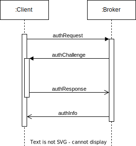

Authentication
==============

For authentication of users, we built upon private and public key cryptography.
There users are identified by their public key.
By default, every user has the role of a guest with limited access to resources.
By signing a message with the private key, the user can prove that he is the owner of the public key and thus authenticate himself.
The user can then be assigned a role that allows him to access certain resources.

How does it work?
-----------------

There are two steps what a client needs to do to authenticate himself:

1. Generating a RSA key pair
2. Answering a challenge

Generating a key pair
~~~~~~~~~~~~~~~~~~~~~

The user generates a key pair consisting of a private and a public key.

In python:

.. code-block:: python

    from Crypto.PublicKey import RSA
    key = RSA.generate(2048)
    private_key = key.export_key()
    public_key = key.publickey().export_key()

In node.js:

.. code-block:: javascript

    const crypto = require('crypto');
    const { privateKey, publicKey } = crypto.generateKeyPairSync('rsa', {
        modulusLength: 2048,
        publicKeyEncoding: {
            type: 'spki',
            format: 'pem'
        },
        privateKeyEncoding: {
            type: 'pkcs8',
            format: 'pem',
        }
    });

In unix:

.. code-block:: bash

    openssl genrsa -out private.pem 2048
    openssl rsa -in private.pem -pubout -out public.pem

Answering a challenge
~~~~~~~~~~~~~~~~~~~~~

The user sends a request to the server (authRequest) and receives  a challenge with a secret message (authChallenge).
After signing the secret message with the private key, the user sends the signed message (authResponse) to the server.
If the server can verify the signature, the user is authenticated an receives a information about his role (authInfo).

Example code
~~~~~~~~~~~~

We use `PKCS#1 v1.5 (RSA) <https://datatracker.ietf.org/doc/html/rfc8017#section-8.2>`_ as a digital signature algorithm and
the `PyCryptodome API <https://pycryptodome.readthedocs.io/en/latest/>`_ for the implementation.

In python:

.. code-block:: python

    from Crypto.PublicKey import RSA
    from Crypto.Signature import PKCS1_v1_5
    from Crypto.Hash import SHA256
    import socketio

    url = '<broker_url>'

    sio = socketio.Client()

    def sign(secret):
        key = RSA.import_key(open('private.pem').read())
        pub_key = key.publickey().export_key("DER")
        h = SHA256.new(secret.encode('utf-8'))
        signature = PKCS1_v1_5.new(key).sign(h)
        return {'pub': pub_key.hex(), 'sig': signature.hex()}

    sio.on('connect', lambda: [sio.emit('authRequest')])
    sio.on('authChallenge', lambda data: [sio.emit('authResponse', sign(data['secret']))])
    sio.on('authInfo', lambda data: [print(data['role'])])
    sio.connect(url)

In node.js:

.. code-block:: javascript

    const crypto = require('crypto');
    const io = require('socket.io-client');
    const socket = io.connect('<broker_url>');

    function sign(secret) {
        const privateKey = fs.readFileSync('private.pem', 'utf8');
        const key = crypto.createPrivateKey(privateKey);
        const pubKey = crypto.createPublicKey(key);
        const signature = crypto.sign('sha256', Buffer.from(secret), {
            key: key,
            padding: crypto.constants.RSA_PKCS1_PADDING,
        });
        return {
            pub: pubKey.export({type: 'spki', format: 'pem'}).toString('hex'),
            sig: signature.toString('hex'),
        };
    }

    socket.on('connect', () => socket.emit('authRequest'));
    socket.on('authChallenge', (data) => socket.emit('authResponse', sign(data.secret)));
    socket.on('authInfo', (data) => console.log(data.role));
    socket.connect();

Roles
-----

The following roles are currently supported:

- guest: The user has only limit access to resources.
- user: The user is registered with a public key.
- admin: The user has full access to all resources.

.. tip::

    See :doc:`./config` for more information about how to configure settings for roles.

To change the role of a user, you can use the brokers' client:

.. code-block:: bash

    python3 client.py broker assign --key "<public key>" --role "<role>"
